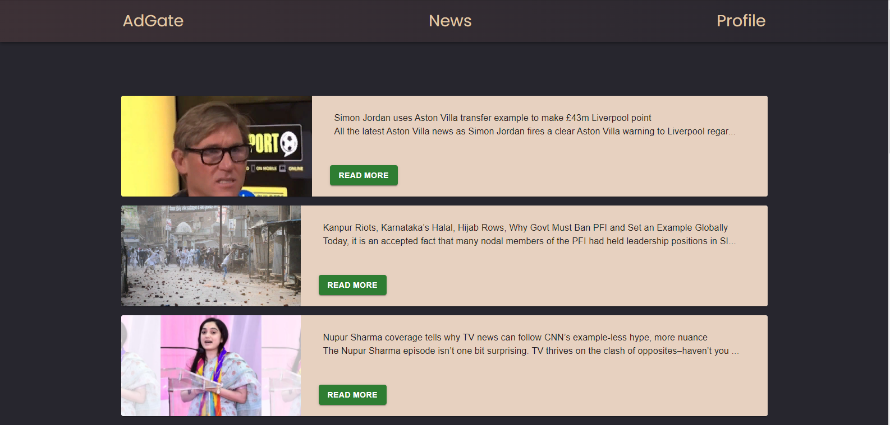

# Pet Project | Ad Gate

## Стек:

- React
- TypeScript
- Redux Toolkit
- React Router

## Доп. библиотеки:

- React hook Form
- Material UI

## Главная страница

При входе на главную страницу идёт запрос на https://dummyjson.com/products , откуда загружается 20 товаров.

## Страница новостей

При переходе на вкладку **News** делается запрос на https://gnews.io , и так же как и с главной страницей эта информация отрисовывается.

## Страница Профиля

При попытке зайти на страницу профиля будет производиться проверка в стор (redux toolkit), и если поле **auth** находится в состоянии **false**, то через хук _useNavige_ пользователь будет переведён на страницу _/login_

Для входа в систему необходимо указать:

- Login: Admin
- Password: 12345

В случае, если информация введена неверно, то через useHookForm происходит валидация

При вводе верных данных происходит перевод на _/profile_

В профиле отображается плейсхолдер для фото, логин, пароль, а также другая информация.  
При нажатии на кнопку _Выйти_ в сторе поле auth меняется на **false**, и происходит переход на страницу авторизации.

## Доп. информация:

Весь стор соххраняется в _localStorage_ благодаря _redux persist_.  
Для того, что бы очистить стор, необходимо на странице нажать клавишу _F12 (ПКМ, Исследовать элемент) => Application => Storage/Local storage => в правой части выбрать сохраненные данные и удалить их._

## Ссылки:

- Деплой: https://ardryzhov.github.io/pet-pr-adgate/
- Product API: https://dummyjson.com/products
- News API: https://gnews.io
